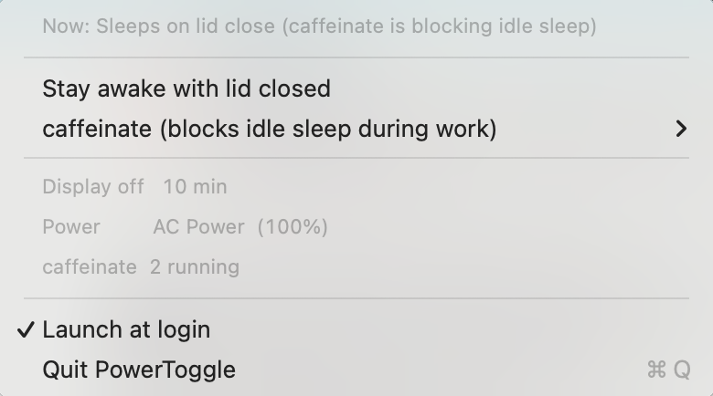
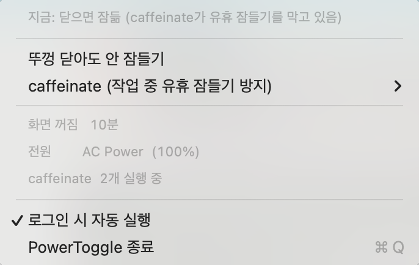

# PowerToggle

A macOS menu bar toggle for the setting that keeps your MacBook awake with the lid closed.

The menu follows your system language.

<p>
  
  
</p>

## Why this exists

My laptop lost more than 40% of its battery overnight with the lid shut. The cause was `pmset disablesleep 1`, a setting I had turned on at some point and completely forgotten about. While it is on, closing the lid only turns off the display. The CPU and the network keep running.

The only way to change it is `sudo pmset -a disablesleep 0` in a terminal, so once it is on, nobody ever turns it back off. PowerToggle puts it in the menu bar. The bolt icon means the machine stays awake, the moon means it sleeps.

## What it toggles

**Lid-close sleep prevention** (`pmset disablesleep`)

On means the machine stays fully awake with the lid closed. Useful with an external display or during a long build. Off is what you want the rest of the time.

**A caffeinate shim** (three modes)

`caffeinate` is the built-in macOS command that blocks idle sleep. Plenty of CLI tools spawn it while they work. Claude Code, for example, runs `caffeinate -i -t 300`, respawns it every four minutes, and kills it 30 seconds after the work finishes. There is no setting to turn that off. The flag is a constant in the binary.

So this puts a shim ahead of `/usr/bin/caffeinate` in `PATH` and decides per mode:

| Mode | Behavior |
|:--|:--|
| `on` | Always pass through. Same as stock macOS |
| `auto` | Pass through on AC power, block on battery (default) |
| `off` | Always block, and kill any caffeinate already running |

If the invocation wraps a command (`caffeinate -i make build`), the shim always passes it through regardless of mode. Blocking it would stop the wrapped command from running at all.

## Install

```sh
git clone https://github.com/jan166/power-toggle.git
cd power-toggle
./install.sh
```

You need Xcode or the Command Line Tools for `swiftc` (`xcode-select --install`). The app builds to `~/Applications/PowerToggle.app` and registers a login item. Pass `--no-login-item` to skip that.

The install script never uses root.

### Toggling without a password

Changing `pmset disablesleep` needs root, so right after install every toggle brings up the macOS authentication dialog. Click **Set up passwordless toggling** in the menu once and it installs a sudoers rule. After that the toggle applies instantly, and the menu item disappears since it has nothing left to do.

The rule is these two lines and nothing else:

```
<user> ALL=(root) NOPASSWD: /usr/bin/pmset -a disablesleep 0
<user> ALL=(root) NOPASSWD: /usr/bin/pmset -a disablesleep 1
```

sudoers matches the command and its arguments exactly, so this grants no other privileges. To undo it: `sudo rm /etc/sudoers.d/pmset-lid-toggle`.

## From the terminal

The menu bar is optional. Both CLIs work on their own.

```sh
lid              # current state
lid off          # sleep on lid close (saves battery)
lid on           # stay awake on lid close
lid toggle

caf              # caffeinate mode, plus every process currently blocking sleep
caf on | auto | off
caf toggle
```

Without the sudoers rule, `lid` falls back to prompting for your password.

## When the icon does not show up

This is common on MacBooks with a notch. Status items can only go in the region to the right of the notch, and once that region fills up, macOS parks new items behind the notch or off screen. The app runs fine and the icon is simply nowhere.

Every launch writes its own position to a log:

```sh
cat /tmp/pt-diag.log
# x=999.0 w=29.0 occlusion=hidden img=true
```

If `x` is smaller than where the right-hand region starts, the icon is covered. You can read that boundary from `NSScreen.auxiliaryTopRightArea`. On a 14-inch M1 Pro running at 1800x1169pt it was 1010, with the notch occupying 790 through 1010.

Do not trust the `occlusion` value. It reports `hidden` even when the icon is plainly visible. Go by `x`.

Two things to suspect:

**1. A menu bar manager** (Ice, Hidden Bar, Bartender)

This is usually it. PowerToggle always lands in the leftmost slot, and that slot is typically inside a manager's hidden section. Move it to the always-visible section in the manager's settings. In my case Hidden Bar was hiding it and I spent a long time blaming the notch.

**2. A genuinely full menu bar**

Remove one icon and a slot opens up. The input source indicator and the Spotlight icon are each about 34pt.

Dragging with **Command held down** is the only way to move a status item. Writing `NSStatusItem Preferred Position` with `defaults` does not work. I tried 1040, 1500, and 1600, and macOS kept placing the item in the leftmost free slot anyway.

## Layout

| File | Role |
|:--|:--|
| `PowerToggle.swift` | The menu bar app. No dependencies |
| `bin/caffeinate` | The shim. Either execs the real caffeinate or exits immediately |
| `bin/lid` | CLI for lid-close sleep prevention |
| `bin/caf` | CLI for the caffeinate mode |
| `build.sh` | Builds the app bundle |
| `install.sh` | Installs all of the above |

The app and the CLIs share one file, `~/.config/caffeinate-toggle/mode`. Change the mode from either side and the other picks it up.

The build writes SDK keys such as `DTSDKName` into `Info.plist`. Without them AppKit treats a hand-rolled bundle as an old-SDK build and applies the legacy 22pt menu bar metrics, which misplaces the status item.

## Uninstall

```sh
launchctl bootout gui/$(id -u)/com.hyoju.powertoggle
rm -rf ~/Applications/PowerToggle.app
rm -f ~/.local/bin/lid ~/.local/bin/caf ~/.local/bin/caffeinate
rm -rf ~/.config/caffeinate-toggle
rm -f ~/Library/LaunchAgents/com.hyoju.powertoggle.plist
defaults delete com.hyoju.powertoggle
sudo rm -f /etc/sudoers.d/pmset-lid-toggle
```

## Tested on

macOS 15.7.3, 14-inch MacBook Pro (M1 Pro), Xcode 26. `LSMinimumSystemVersion` is set to 12.0, but nothing below 15.7 was verified.

## Language

English and Korean, picked from your system language. The app reads `Locale.preferredLanguages`, the CLIs read `AppleLanguages` and fall back to `$LANG`. Anything starting with `ko` gets Korean, everything else gets English.

To pin it instead of following the system:

```sh
defaults write com.hyoju.powertoggle language -string ko   # or en
defaults delete com.hyoju.powertoggle language             # back to following the system
```

The app picks that up on its next launch. Both CLIs read the same key and also honor `POWERTOGGLE_LANG=ko` for a single command, which is handy for checking the other language:

```sh
POWERTOGGLE_LANG=en lid
```

Adding a third language means editing the `t(korean, english)` calls, so it is not set up for that. Code and comments are English throughout.

## 한국어

맥북 뚜껑을 닫아도 잠들지 않게 하는 `pmset disablesleep` 설정과, CLI 도구들이 띄우는 `caffeinate` 를 메뉴바 아이콘 하나로 켜고 끕니다.

`pmset disablesleep` 은 켜져 있으면 뚜껑을 닫아도 화면만 꺼지고 CPU는 계속 돌아서 배터리를 크게 먹습니다. 바꾸려면 sudo가 필요해 한 번 켜두면 다시 안 끄게 되는데, 이 앱은 클릭 한 번으로 바꿉니다. `pmset disablesleep` 두 명령에만 한정된 sudoers 규칙을 넣어 비밀번호 없이 토글할 수도 있습니다.

caffeinate 쪽은 PATH 앞에 shim을 놓아 가로챕니다. 세 모드가 있고 기본값은 `auto` (어댑터를 꽂으면 통과, 배터리면 차단)입니다.

설치는 `./install.sh`. 메뉴와 CLI는 시스템 언어를 따라 한국어 또는 영어로 나옵니다. 시스템이 영어인데 한국어로 보고 싶으면 `defaults write com.hyoju.powertoggle language -string ko`.

메뉴바에 아이콘이 안 보이면 위의 "When the icon does not show up" 을 보세요. 노치가 있는 맥북에서는 메뉴바 관리 앱이 숨기고 있는 경우가 대부분입니다.

## License

MIT
