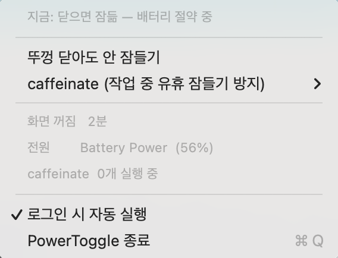

# PowerToggle

맥북 뚜껑을 닫아도 잠들지 않게 하는 설정을 메뉴바에서 켜고 끈다.



## 왜 만들었나

노트북이 밤새 배터리를 40% 넘게 먹는 걸 발견하고 원인을 찾다 나온 게 `pmset disablesleep 1` 이었다. 언제 켰는지 기억도 안 나는 설정인데, 켜져 있으면 뚜껑을 닫아도 화면만 꺼지고 CPU와 네트워크는 계속 돈다. 끄는 방법은 터미널에 `sudo pmset -a disablesleep 0` 을 치는 것뿐이라, 한 번 켜두면 아무도 다시 안 끈다.

메뉴바 아이콘이 지금 상태를 보여주고, 누르면 바뀐다. 번개는 안 잠드는 상태, 달은 잠드는 상태다.

## 두 가지 토글

**뚜껑 닫힘 방지** (`pmset disablesleep`)
켜면 뚜껑을 닫아도 계속 깨어 있다. 외부 모니터를 쓸 때나 긴 작업을 돌릴 때만 쓰고, 평소엔 꺼두는 게 배터리에 좋다.

**caffeinate 차단** (세 모드)
`caffeinate` 는 유휴 상태에서 맥이 잠드는 걸 막는 macOS 기본 명령이다. CLI 도구들이 작업 중에 이걸 띄운다. Claude Code는 `caffeinate -i -t 300` 을 띄우고 4분마다 다시 띄우며 작업이 끝나면 30초 뒤에 죽인다. 끄는 설정값은 없다. 바이너리에 상수로 박혀 있다.

그래서 PATH 앞에 shim을 놓고 가로챈다.

| 모드 | 동작 |
|:--|:--|
| `on` | 항상 통과. macOS 기본 동작과 같다 |
| `auto` | 어댑터를 꽂으면 통과, 배터리면 차단 (기본값) |
| `off` | 항상 차단. 떠 있던 caffeinate도 정리한다 |

`caffeinate -i make build` 처럼 감쌀 명령이 인자로 있으면 모드와 무관하게 항상 통과시킨다. 차단하면 그 명령 자체가 실행되지 않기 때문이다.

## 설치

```sh
git clone https://github.com/jan166/power-toggle.git
cd power-toggle
./install.sh
```

Xcode 또는 Command Line Tools가 필요하다 (`xcode-select --install`). 앱은 `~/Applications/PowerToggle.app` 으로 빌드되고, 로그인 시 자동 실행되게 등록된다. 자동 실행이 싫으면 `./install.sh --no-login-item`.

설치 스크립트는 root 권한을 쓰지 않는다.

### 비밀번호 없이 토글하기

`pmset disablesleep` 변경에는 root 권한이 필요하다. 설치 직후에는 토글할 때마다 macOS 인증창이 뜬다. 메뉴의 **비밀번호 없이 토글하기 설정...** 을 한 번 누르면 sudoers 규칙이 깔리고, 그 다음부터는 즉시 반영된다.

규칙은 이 두 줄이 전부다.

```
<사용자> ALL=(root) NOPASSWD: /usr/bin/pmset -a disablesleep 0
<사용자> ALL=(root) NOPASSWD: /usr/bin/pmset -a disablesleep 1
```

명령과 인자가 정확히 일치할 때만 적용되므로 다른 sudo 권한은 열리지 않는다. 되돌리려면 `sudo rm /etc/sudoers.d/pmset-lid-toggle`.

## 터미널에서

메뉴바 없이도 쓸 수 있다.

```sh
lid              # 현재 상태
lid off          # 닫으면 잠들게 (배터리 절약)
lid on           # 닫아도 안 잠들게
lid toggle

caf              # caffeinate 모드 + 지금 잠들기를 막고 있는 프로세스 목록
caf on | auto | off
caf toggle
```

`lid` 는 sudoers 규칙이 없으면 비밀번호를 물어보는 방식으로 폴백한다.

## 아이콘이 안 보일 때

노치가 있는 맥북에서 자주 겪는 문제다. 상태 아이콘은 노치 오른쪽 영역에만 들어갈 수 있고, 그 영역이 차면 macOS가 새 항목을 노치 뒤나 화면 밖에 놓는다. 앱은 정상 실행 중인데 아이콘만 없는 상태가 된다.

앱이 실행될 때마다 자기 위치를 남긴다.

```sh
cat /tmp/pt-diag.log
# x=999.0 w=29.0 occlusion=hidden img=true
```

`x` 값이 노치 오른쪽 영역의 시작 좌표보다 작으면 가려진 것이다. 그 좌표는 `NSScreen.auxiliaryTopRightArea` 로 알 수 있다. 14인치 M1 Pro를 1800x1169pt로 쓸 때 1010이었고, 노치는 790부터 1010까지를 차지했다.

`occlusion` 값은 믿지 말 것. 아이콘이 멀쩡히 보이는 상태에서도 `hidden` 으로 나온다. 판단은 `x` 로 한다.

의심할 것은 두 가지다.

**1. 메뉴바 관리 앱** (Ice, Hidden Bar, Bartender)
이게 대부분의 원인이다. PowerToggle은 항상 가장 왼쪽 자리에 배치되고, 그 자리는 보통 관리 앱의 "숨김" 구역이다. 관리 앱 설정에서 항상 보이는 구역으로 옮기면 된다. 내 경우 Hidden Bar가 숨기고 있었고, 노치 문제라고 한참 잘못 짚었다.

**2. 메뉴바가 실제로 꽉 찬 경우**
아이콘 하나를 치우면 자리가 생긴다. 입력기 표시나 Spotlight 아이콘이 각각 34pt 정도다.

아이콘 위치를 옮기는 방법은 **⌘를 누른 채 드래그** 하나뿐이다. `defaults` 로 `NSStatusItem Preferred Position` 값을 써넣는 건 무시된다. 1040, 1500, 1600을 다 넣어봤지만 macOS는 계속 가장 왼쪽 빈 자리에 놓았다.

## 구성

| 파일 | 역할 |
|:--|:--|
| `PowerToggle.swift` | 메뉴바 앱. 외부 의존성 없음 |
| `bin/caffeinate` | PATH 앞에 놓는 shim. 모드에 따라 실제 caffeinate로 넘기거나 즉시 종료 |
| `bin/lid` | 뚜껑 닫힘 방지 CLI |
| `bin/caf` | caffeinate 모드 CLI |
| `build.sh` | 앱 번들 빌드 |
| `install.sh` | 위 전부 설치 |

앱과 CLI는 `~/.config/caffeinate-toggle/mode` 파일 하나를 같이 읽고 쓴다. 어느 쪽에서 바꿔도 반대쪽에 반영된다.

빌드할 때 Info.plist에 `DTSDKName` 같은 SDK 키를 넣는다. 손으로 만든 앱 번들에 이 키가 없으면 AppKit이 구형 SDK 빌드로 인식해서 레거시 메뉴바 규격(22pt)을 적용한다.

## 제거

```sh
launchctl bootout gui/$(id -u)/com.hyoju.powertoggle
rm -rf ~/Applications/PowerToggle.app
rm -f ~/.local/bin/lid ~/.local/bin/caf ~/.local/bin/caffeinate
rm -rf ~/.config/caffeinate-toggle
rm -f ~/Library/LaunchAgents/com.hyoju.powertoggle.plist
defaults delete com.hyoju.powertoggle
sudo rm -f /etc/sudoers.d/pmset-lid-toggle
```

## 확인한 환경

macOS 15.7.3, 14인치 MacBook Pro (M1 Pro), Xcode 26. `LSMinimumSystemVersion` 은 12.0으로 잡아뒀지만 그 아래 버전에서는 확인하지 않았다.

## In English

A macOS menu bar toggle for two sleep-related settings.

The first is `pmset disablesleep`, which keeps the machine awake with the lid closed. It normally takes a `sudo` command to change, so people leave it on and drain the battery overnight. PowerToggle puts it one click away and can install a narrowly scoped sudoers rule (two exact `pmset` commands, nothing else) so toggling needs no password.

The second is a `caffeinate` shim. CLI tools spawn `caffeinate` to block idle sleep while they work, often with no way to turn it off. The shim sits ahead of `/usr/bin/caffeinate` in `PATH` and passes it through, blocks it, or blocks only on battery power. Commands wrapped by caffeinate (`caffeinate -i make build`) always pass through.

Requires Xcode Command Line Tools. Run `./install.sh`. If the icon does not appear in the menu bar, read the troubleshooting section above; on notched MacBooks a menu bar manager is usually hiding it.

## License

MIT
